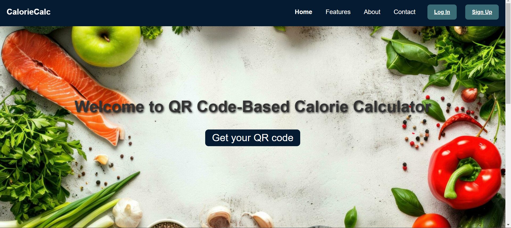
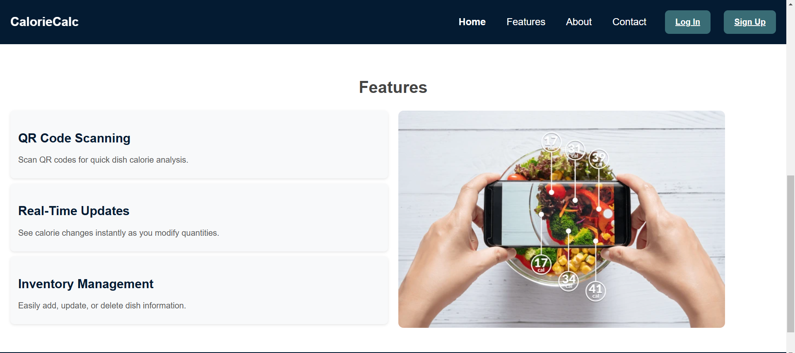
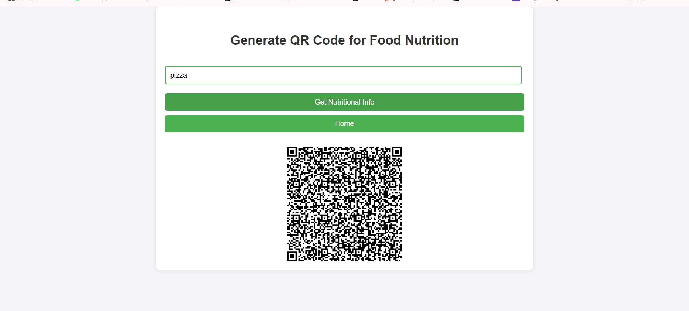
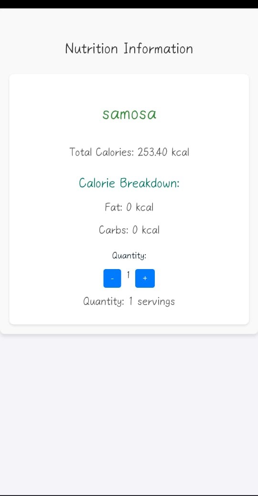

# QR Code-Based Calorie Calculator

## Overview

The QR Code-Based Calorie Calculator is a web application that allows users to calculate the calorie count of their meals by scanning QR codes. Each QR code represents a dish and contains nutritional information about it. The app lets users modify the quantity of each dish and instantly get updated calorie counts. The goal is to help health-conscious individuals make informed food choices.

## Features

- **QR Code Scanning**: Scan QR codes to retrieve the calorie breakdown of a dish.
- **Real-Time Updates**: Modify the quantities of ingredients and see the calorie changes instantly.
- **Inventory Management**: Manage dishes and their constituent items using CRUD functionality.
- **User-Friendly Interface**: Easy navigation and interactive UI for a smooth experience.

## Technologies Used

### Frontend:
- **React.js**: A JavaScript library for building user interfaces.
- **CSS**: For styling the pages and creating a responsive design.
- **HTML**: Structure and content layout.

### Backend:
- **Node.js**: A JavaScript runtime built on Chrome's V8 engine for server-side operations.
- **Express.js**: A Node.js web application framework for routing and API handling.
- **MongoDB**: A NoSQL database for storing user data and nutritional information.
- **Axios**: For making HTTP requests to the nutrition API.

### Other Libraries:
- **react-router-dom**: For navigation between pages.
- **react-qr-code**: For generating QR codes dynamically.

## Installation

To get started, clone the repository and follow the installation steps below.

### 1. Clone the repository
```bash
git clone https://github.com/anisha314/7569.git
```

### 2. Install Dependencies
Navigate to both the client (frontend) and server (backend) directories and install the dependencies.

#### Frontend
1. Navigate to the frontend directory:
   cd qr-calorie-calculator/frontend
2. Install dependencies:
   npm install

#### Backend
1. Navigate to the backend directory:
   cd qr-calorie-calculator/backend
2. Install dependencies:
   npm install

### 3. Set up the Backend
1. Make sure MongoDB is running or connect to an online database (like MongoDB Atlas).
2. Replace the MongoDB URI in `index.js` with your own if using a local or remote MongoDB instance.

### 4. Start the Development Server

#### Frontend
1. Navigate to the frontend directory:
   cd qr-calorie-calculator/frontend
2. Start the React development server:
   npm start

#### Backend
1. Navigate to the backend directory:
   cd qr-calorie-calculator/backend
2. Start the Node.js server:
   node index.js

The app should now be running at `http://localhost:3000` for the frontend and `http://localhost:9879` for the backend.

## Project Structure

### Frontend
- **/components**: Contains all React components like Navbar, HomePage, AboutPage, etc.
- **/pages**: Contains individual page components.
- **/assets**: Contains images and other static files.
- **App.js**: Main entry point for the React app, which includes routing.
- **index.js**: Entry point for React application.

### Backend
- **/models**: Contains MongoDB models (like User).
- **/routes**: Contains Express.js routes for handling requests related to users, dishes, etc.
- **index.js**: Main server file for setting up Express.js, middleware, and database connection.

## API Integration

### Nutrition API
The app fetches nutritional data for a given food item using the **API Ninjas** service. The app sends a request to the API with the food item name and receives nutritional data like calories, fat, carbs, and protein. This data is then displayed to the user and embedded into a QR code.

## How It Works

1. **Home Page**: Users land on the home page where they can generate a QR code for a food item.
2. **QR Code Generation**: By entering a food item (e.g., pizza, burger), the app fetches nutritional data from an API, and generates a QR code containing this data.
3. **Scanning the QR Code**: Users can scan the QR code to view detailed nutritional information on a separate page.
4. **Modify Quantities**: Users can increase or decrease the quantity of the dish, and the calorie count is updated in real-time.

## Screenshots

### Home Page




### QR Code Generation



### Nutrition Information



## Contributing

1. Fork the repository.
2. Create a new branch (`git checkout -b feature-branch`).
3. Make your changes.
4. Commit your changes (`git commit -am 'Add new feature'`).
5. Push to the branch (`git push origin feature-branch`).
6. Create a new Pull Request.
